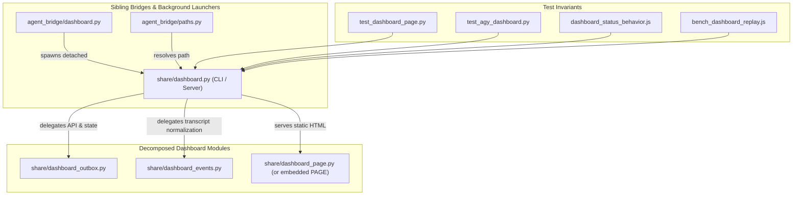

# Dashboard Refactor Report: Decomposition Architecture and Execution Plan

**Date**: September 16, 2026  
**Role**: Read-only Explorer  
**Objective**: Smallest safe, high-value refactor decomposing `src/agent_bridge/share/dashboard.py` (~3,500 lines) without changing behavior.  
**Repository State**: Git HEAD `95e9158` (`improve title bar`) on branch `main` with user working-tree modifications preserved.

---

## 1. Executive Summary & Core Verdict

[`src/agent_bridge/share/dashboard.py`](file:///C:/Users/Touma/Documents/Agent-Bridge/src/agent_bridge/share/dashboard.py) currently acts simultaneously as:
1. A standalone executable CLI HTTP server.
2. A backend data ingestion, transformation, and outbox RPC handler (managing `state.json`, `transcripts/*.jsonl`, and `outbox/`).
3. An embedded frontend single-page application (~2,495 lines of HTML, CSS, and vanilla JavaScript bundled in a raw Python multiline string `PAGE`).

### Critical Findings & Constraints
- **Packaging Constraint**: In [`pyproject.toml`](file:///C:/Users/Touma/Documents/Agent-Bridge/pyproject.toml#L37-L45), Hatchling packages only `packages = ["src/agent_bridge"]` and explicitly force-includes specific files. Crucially, any Python module inside `src/agent_bridge/` or `src/agent_bridge/share/` is automatically packaged into wheel builds by Hatchling as code, **without requiring package-data edits**.
- **Launcher Contract**: [`agent_bridge/paths.py::bundled_dashboard()`](file:///C:/Users/Touma/Documents/Agent-Bridge/src/agent_bridge/paths.py#L113-L121) and [`agent_bridge/dashboard.py::_launch()`](file:///C:/Users/Touma/Documents/Agent-Bridge/src/agent_bridge/dashboard.py#L82-L102) require `bundled_dashboard()` to point to an executable entry point (`sys.executable, str(script), "--port", ...`). Therefore, `src/agent_bridge/share/dashboard.py` **must remain the executable entry point** preserving `main()`, `Handler`, and `PAGE`.
- **Node Test Harness Coupling**: [`tests/dashboard_status_behavior.js`](file:///C:/Users/Touma/Documents/Agent-Bridge/tests/dashboard_status_behavior.js#L21-L28) and [`scripts/bench_dashboard_replay.js`](file:///C:/Users/Touma/Documents/Agent-Bridge/scripts/bench_dashboard_replay.js#L40-L45) inspect and regex-parse `src/agent_bridge/share/dashboard.py` searching for:
  ```js
  const m = src.match(/PAGE = r"""([\s\S]*?)"""/);
  ```
  Extracting the frontend out into standalone `.html`/`.css`/`.js` files in slice 1 would break these test fixtures or require invasive multi-file tooling rewrites.
- **External Static Route Risks**: Attempting to serve static `.css` / `.js` assets over HTTP routes would break the strict Content Security Policy (`default-src 'none'; script-src 'unsafe-inline'; style-src 'unsafe-inline'`), create path-traversal attack vectors, and cause caching/versioning staleness across Bridge background reloads.
- **Recommended Smallest Safe Slice**: Decompose `dashboard.py` purely on the **Python data and API service layer first**. Extract ~580 lines of backend logic (state loading, transcript normalizer, live usage tail scanner, outbox queue/dequeue/task-action helpers) into cohesive internal modules inside `src/agent_bridge/share/` or `src/agent_bridge/`. `dashboard.py` re-exports them and continues exposing `PAGE`, `Handler`, and `DashboardServer`. This achieves an immediate, independently testable reduction with zero risk to packaging, tests, or security contracts.

---

## 2. Top-Level Responsibilities & Exact Symbol Boundaries

The current `src/agent_bridge/share/dashboard.py` (3,538 lines) divides cleanly into 5 distinct domains:

| Domain | Line Range | Responsibilities | Key Symbols / Exports |
| :--- | :--- | :--- | :--- |
| **Python Backend: Data & Helpers** | L1–L588 | Process liveness, transcript JSONL normalization, event streaming, live-usage caching, and outbox queue inspection. | `PRESENCE`, `PRESENCE_TTL`, `presence_update`, `presence_count`, `SAFE_ID`, `MSG_NAME_RE`, `REQ_NAME_RE`, `OUTBOX_MSG_MAX_AGE_SEC`, `TASK_ACTION_EXPIRE_SEC`, `_my_create_time`, `_owner_alive`, `_dash_claim_name`, `_task_action_fields`, `outbox_queue`, `load_state`, `_AGY_TOOL_KINDS`, `_AGY_KIND_HINTS`, `_AGY_DONE_STATES`, `_agy_tool_kind`, `_legacy_payload_flat`, `normalize_event`, `read_events`, `LIVE_SEED_BYTES`, `_LIVE_TAIL`, `_LIVE_LOCK`, `_instant`, `_usage_consumed_last`, `_live_consumed`, `live_usage_map` |
| **HTML Shell & Bootstrap** | L589–L613, L945–L1016 | Document `<head>`, theme & locale pre-paint bootstrap scripts, DOM skeleton (`#sidebar`, `#pane`, `#conv`, `#rail`, `#chatbar`). | Embedded in `PAGE` |
| **CSS Stylesheet** | L614–L943 | Light/Dark design system, layout grid (`.hgrid`), animations (`pulse`, `ui-spin`), Voyager rail positioning, responsive breakpoints. | Embedded in `<style>` inside `PAGE` |
| **Client-Side JavaScript** | L1017–L3083 | In-browser SPA runtime, i18n dictionaries, icon registry, SVG avatars, markdown parser, timeline rail, polling loops, composer. | Embedded in `<script>` inside `PAGE` (see JS detailed map below) |
| **HTTP Server & Entry Point** | L3087–L3538 | Standalone HTTP server handling routing, CSP headers, API endpoints, socket binding, argument parsing, and process lifecycle. | `Handler` (`do_GET`, `do_POST`, `_json`), `DashboardServer` (`allow_reuse_address`, `server_bind`), `main()` |

### Detailed JavaScript Breakdown within `PAGE` (L1017–L3083)
1. **Core State & Heartbeat** (L1017–L1045): Presence ping via `navigator.sendBeacon` and `fetch('/api/presence')`.
2. **i18n Dictionaries & Engine** (L1046–L1538): `LOCALES` (`en`, `zh-CN`, `zh-TW`), `pluralForm`, `t()`, `fmtNum`, `fmtTs`, `ago`, `applyStatic`.
3. **Icons & Seeded Avatars** (L1539–L1610): `ICONS` inline SVGs, `BRANDS` (Devin, Claude, Codex, Cursor), `SUBAV` gradients, `subSeed`, `agentAvatar`.
4. **Markdown Formatter** (L1611–L1646): `md()` parser supporting fenced code blocks, inline code, headings, lists, bold.
5. **Status & Metrics Helpers** (L1647–L1868): `latestTask`, `PROC_STATUS`, `statusOf`, `statusGlyph`, `fmtDur`, `taskDur`, `durText`, `durSpan`, `usageNums`, `tokCount`, `runTok`, `fmtTok`, `tokTitle`, `tokSpan`, `calcTps`, `tpsSpan`, `tickDurations`.
6. **Weekly Usage Aggregator** (L1869–L1969): `weekStartMs`, `livePartial`, `weekContrib`, `weekStats`, `renderWeek`.
7. **Sidebar & Session Header Views** (L1970–L2067): `renderSidebar`, `renderSessionHeader` (with title, status, ID pair, 2x2 control cluster, download button).
8. **Conversation Feed & Stream Merging** (L2068–L2244): `flushBlocks`, `closeBlocks`, `addPrompt`, `msgBlock`, `addMsg`, `addThink`, `addTool`, `addToolStatus`, `addTurn`, `addErr`, `applyEvents`.
9. **Client-side Transcript Exporter** (L2245–L2373): `hasTranscript`, `updateDlBtn`, `sanitizeFilename`, `buildTranscriptFilename`, `sessionToMarkdown`, `downloadTranscript`.
10. **Voyager Navigation Rail** (L2374–L2558): `scheduleRail`, `markRank`, `layoutRail`, `jumpToMark`, `updateCurMark`, `updateRulerWave`, keyboard navigation, wheel forwarding, DOM observers.
11. **Performance Machinery & Cache** (L2559–L2670): `startReplay`, `replay` (rAF-sliced), `stashPane`, `dropPane`, `touchCache`, `dropCache`, `pollEvents`.
12. **Composer, Send Flow & Outbox Controls** (L2671–L2939): `renderLive`, `pollOverview`, `sendChat`, `pollSendStatus`, `taskActions`, `taskAction`, `renderQueue`, `dequeueMsg`, `steerMsg`, `delMsg`.
13. **Settings & Bootstrap Controllers** (L2940–L3083): Drawer toggle, theme controls (`applyTheme`, `setThemePref`), language controls (`rerenderLocale`, `applyLocale`, `setLocalePref`), `select(id)`.

---

## 3. Packaging and Runtime Constraints

### 3.1 `bundled_dashboard()`, Fallback, and Direct Execution
- [`agent_bridge.paths::bundled_dashboard()`](file:///C:/Users/Touma/Documents/Agent-Bridge/src/agent_bridge/paths.py#L113-L121) looks for candidates:
  ```python
  candidate in (
      here.parent / "share" / "dashboard.py",
      here.parents[2] / "src" / "agent_bridge" / "share" / "dashboard.py",
  )
  ```
- [`agent_bridge.dashboard::_launch()`](file:///C:/Users/Touma/Documents/Agent-Bridge/src/agent_bridge/dashboard.py#L82-L102) spawns the dashboard detached via:
  ```python
  argv = [sys.executable, str(script), "--port", str(port), "--dir", str(home)]
  ```
- Compatibility fallback: If `bundled_dashboard()` is not a file, it falls back to `home / "dashboard.py"`.
- **Constraint**: `src/agent_bridge/share/dashboard.py` must remain an executable Python script supporting `python dashboard.py --port ... --dir ...`.

### 3.2 Hatchling Wheel Packaging & Package Data
- In [`pyproject.toml`](file:///C:/Users/Touma/Documents/Agent-Bridge/pyproject.toml#L37-L45):
  ```toml
  [tool.hatch.build.targets.wheel]
  packages = ["src/agent_bridge"]
  ```
- Inspection of wheel artifacts (`uv build --wheel`) confirms that Hatchling automatically bundles all `.py` files under `src/agent_bridge/` and `src/agent_bridge/share/`.
- If non-Python static assets (like `.html`, `.css`, `.js`) are placed into `src/agent_bridge/share/`, Hatchling **will omit them by default** unless explicitly listed in `[tool.hatch.build.targets.wheel.force-include]` in `pyproject.toml`.
- Keeping frontend code in Python modules or strings eliminates any risk of wheel build omission or editable-install path discrepancies.

### 3.3 Test Harness Regex & Ast Parsing Constraints
Three critical test suites inspect `dashboard.py` directly:
1. [`tests/test_dashboard_page.py`](file:///C:/Users/Touma/Documents/Agent-Bridge/tests/test_dashboard_page.py):
   - Line 24: `from agent_bridge.share import dashboard`
   - Line 26: `PAGE = dashboard.PAGE`
   - Line 158: `srv = dashboard.DashboardServer(("127.0.0.1", 0), dashboard.Handler)`
   - Line 1243: Parses `Path(dashboard.__file__).read_text(...)` to discover emitted `"error_code"` literals.
   - Lines 1779-2041: Accesses `dashboard._LIVE_TAIL`, `dashboard.TASK_ACTION_EXPIRE_SEC`, `dashboard.LIVE_SEED_BYTES`, `dashboard.PRESENCE`, `dashboard.PRESENCE_TTL`, `dashboard.presence_update`, `dashboard.presence_count`.
2. [`tests/dashboard_status_behavior.js`](file:///C:/Users/Touma/Documents/Agent-Bridge/tests/dashboard_status_behavior.js#L21-L28):
   - Reads `src/agent_bridge/share/dashboard.py` directly using Node's `fs.readFileSync`.
   - Uses regex `src.match(/PAGE = r"""([\s\S]*?)"""/)` to extract the page, then extracts `<script>` tags to run inside Node's `vm` context.
3. [`scripts/bench_dashboard_replay.js`](file:///C:/Users/Touma/Documents/Agent-Bridge/scripts/bench_dashboard_replay.js#L40-L45):
   - Reads `src/agent_bridge/share/dashboard.py` and extracts `PAGE = r"""([\s\S]*?)"""` for jsdom execution.
4. [`tests/test_agy_dashboard.py`](file:///C:/Users/Touma/Documents/Agent-Bridge/tests/test_agy_dashboard.py):
   - Imports `from agent_bridge.share import dashboard` and invokes `dashboard.normalize_event` and `dashboard._usage_consumed_last`.

**Correction to Unsafe Assumptions**: Any refactor that replaces `PAGE = r"""..."""` in `dashboard.py` with an external template read without maintaining the regex-matchable `PAGE = r"""..."""` contract will break `tests/dashboard_status_behavior.js` and `scripts/bench_dashboard_replay.js`.

---

## 4. Phased Decomposition Plan & First Implementation Slice

To achieve high value without big-bang risk, a 3-phase decomposition is recommended:

```
src/agent_bridge/
├── dashboard.py                       (Launcher / auto-open daemon - unchanged)
└── share/
    ├── dashboard.py                   (Entry point CLI, Handler, DashboardServer, re-exports)
    ├── dashboard_events.py            (Phase 1: Transcript parsing, normalization, live tail)
    ├── dashboard_outbox.py            (Phase 1: Outbox queue, claim names, task-action helpers)
    └── dashboard_page.py              (Phase 2: PAGE string constant & HTML/CSS/JS assembly)
```



### Phase 1: Smallest Safe, High-Value Implementation Slice (Recommended Immediate Slice)
Extract the pure Python backend helpers into two cohesive modules:
1. `src/agent_bridge/share/dashboard_events.py` (~370 lines):
   - Tool classification mapping (`_AGY_TOOL_KINDS`, `_AGY_KIND_HINTS`, `_AGY_DONE_STATES`, `_agy_tool_kind`).
   - Legacy event unwrapping (`_legacy_payload_flat`, `normalize_event`).
   - Transcript streaming (`read_events`).
   - Live usage incremental tail reader (`LIVE_SEED_BYTES`, `_LIVE_TAIL`, `_LIVE_LOCK`, `_instant`, `_usage_consumed_last`, `_live_consumed`, `live_usage_map`).
2. `src/agent_bridge/share/dashboard_outbox.py` (~170 lines):
   - Outbox identifiers and regexes (`SAFE_ID`, `MSG_NAME_RE`, `REQ_NAME_RE`, `MAX_INPUT_CHARS`, `OUTBOX_MSG_MAX_AGE_SEC`, `TASK_ACTION_EXPIRE_SEC`).
   - Process creation and owner identity helpers (`_my_create_time`, `_owner_alive`, `_dash_claim_name`, `_task_action_fields`).
   - Queue reading (`outbox_queue`, `load_state`).
3. In `src/agent_bridge/share/dashboard.py`:
   - Import and re-export all symbols so `from agent_bridge.share import dashboard` remains 100% backwards-compatible.
   - `Handler` methods call these helpers.
   - `PAGE` remains intact in `dashboard.py`.
   - **Net Result**: 540 lines of Python logic removed from `dashboard.py` into testable unit modules. Zero changes to JS/CSS, zero risk to Node harnesses.

### Phase 2: Python Asset Modularization (`dashboard_page.py`)
- Extract `PAGE` into `src/agent_bridge/share/dashboard_page.py`.
- In `dashboard.py`:
  ```python
  from agent_bridge.share.dashboard_page import PAGE
  ```
- **Prerequisite**: Update `tests/dashboard_status_behavior.js` and `scripts/bench_dashboard_replay.js` to either support `DASH_PAGE` environment variable (which `bench_dashboard_replay.js` already supports!) or follow the import to `dashboard_page.py`.

### Phase 3: Frontend Component Assembly (Future Evolution)
- Break `PAGE` into discrete strings or files: `head.html`, `theme.css`, `locales.js`, `app.js`, assembled at module import time.
- (See Section 5 for why assembly in Python is vastly superior to serving discrete files over HTTP).

---

## 5. Page Assembly Architecture & Security Analysis

### Python Constant Assembly vs External HTTP Routes

| Dimension | External HTTP Static Routes (`/static/*`) | Packaged Python Modules / Python Assembly |
| :--- | :--- | :--- |
| **CSP Compliance** | Requires adding `'self'` to `script-src` and `style-src`. Weakens XSS protection if an attacker controls outbox text. | Retains current strict CSP: `default-src 'none'; script-src 'unsafe-inline'; style-src 'unsafe-inline'; img-src data:; connect-src 'self'`. |
| **Packaging Robustness** | Requires updating `pyproject.toml` `force-include` for wheel packaging; easy to miss during distribution. | Hatchling automatically bundles `.py` modules without any packaging metadata changes. |
| **Caching & Invalidation** | Browser HTTP caches may serve stale `.js` or `.css` when Bridge upgrades in place unless cache-busting hashes are added. | 100% cache-coherent: every `GET /` serves the exact assembled code of the running backend instance. |
| **Path Traversal Risk** | High: Custom HTTP handler must sanitize file paths against `..` and Windows alternate data streams. | Zero path traversal: assets are loaded from memory in Python. |
| **Test Harness Impact** | Breaks `dashboard_status_behavior.js` and `bench_dashboard_replay.js` unless harnesses are rewritten to simulate HTTP downloads. | Harmless: `PAGE` string remains inspectable by tests. |

**Recommendation**: Assemble `PAGE` in Python. Do not introduce external static file HTTP endpoints.

---

## 6. Test Impact & Verification Matrix

### 6.1 Test Suites That Must Stay Stable
- [`tests/test_dashboard_page.py`](file:///C:/Users/Touma/Documents/Agent-Bridge/tests/test_dashboard_page.py) (72 tests): Must pass completely without modifying test assertions.
- [`tests/dashboard_status_behavior.js`](file:///C:/Users/Touma/Documents/Agent-Bridge/tests/dashboard_status_behavior.js) (~80 assertions): Node harness verifying proc states, duration formatting, and transcript downloads. Must pass with code 0.
- [`scripts/bench_dashboard_replay.js`](file:///C:/Users/Touma/Documents/Agent-Bridge/scripts/bench_dashboard_replay.js): Benchmark for replay performance and DOM write batching.
- [`tests/test_agy_dashboard.py`](file:///C:/Users/Touma/Documents/Agent-Bridge/tests/test_agy_dashboard.py) (12 tests): Verifies Antigravity transcript normalization.
- [`tests/test_dashboard_open.py`](file:///C:/Users/Touma/Documents/Agent-Bridge/tests/test_dashboard_open.py) (22 tests): Verifies auto-open debounces, process job breakaway, and presence.
- [`tests/test_packaging.py`](file:///C:/Users/Touma/Documents/Agent-Bridge/tests/test_packaging.py) (2 tests): Verifies wheel distribution.

### 6.2 Pre-Refactor Characterization Tests to Add
Before executing Slice 1, add isolated characterization tests in `tests/test_dashboard_units.py` to lock in:
1. `normalize_event` edge cases (legacy payload unwrapping, tool inputs, usage events).
2. `live_usage_map` incremental tail reading (file shrink/rotation, invalid timestamps, timezone comparisons).
3. `outbox_queue` filtering (`msg_*.json` regex matching, sorted timestamp ordering).
4. `_dash_claim_name` format with and without `psutil`.
5. `_task_action_fields` logic for dead vs active sessions.

### 6.3 Tier 1 / Tier 2 Verification Matrix

| Tier | Command | Scope | Target Duration |
| :--- | :--- | :--- | :--- |
| **Tier 1 (Fast Cycle)** | `uv run pytest tests/test_dashboard_page.py tests/test_agy_dashboard.py tests/test_dashboard_open.py` | Core dashboard unit & HTTP contracts | ~25s |
| **Tier 1 (Node JS)** | `node tests/dashboard_status_behavior.js` | Status, duration, download, and rail DOM behavior | ~2s |
| **Tier 2 (Benchmark)** | `node scripts/bench_dashboard_replay.js` | Performance benchmarks and layout metrics under jsdom | ~10s |
| **Tier 2 (Packaging)** | `uv run pytest tests/test_packaging.py` | Wheel packaging integrity | ~3s |
| **Tier 2 (Full Suite)** | `uv run pytest` | Full regression verification (792 tests) | ~100s |

---

## 7. Acceptance Criteria, Do-Not-Touch Areas & Rollback Strategy

### 7.1 Explicit Acceptance Criteria for Slice 1
1. **Zero Behavioral Change**:
   - `python src/agent_bridge/share/dashboard.py --port 8787 --dir <path>` starts and operates identically.
   - All HTTP endpoints (`/`, `/api/overview`, `/api/events`, `/api/send`, `/api/send_status`, `/api/dequeue`, `/api/task_action`, `/api/presence`, `/api/client_state`) return identical status codes and JSON schemas.
2. **Re-export Contract**:
   - Every public and semi-private symbol previously accessed on `agent_bridge.share.dashboard` (`_LIVE_TAIL`, `TASK_ACTION_EXPIRE_SEC`, `normalize_event`, etc.) remains importable from `agent_bridge.share.dashboard`.
3. **Packaging Invariant**:
   - Building the wheel (`uv build --wheel`) includes all new modules under `agent_bridge/share/` without errors.
4. **Test Cleanliness**:
   - Tier 1 and Tier 2 test suites pass with 100% success.
5. **Preserved Working State**:
   - The uncommitted header avatar removal in `src/agent_bridge/share/dashboard.py` (L2055) and timing adjustment in `scripts/bench_dashboard_replay.js` (L390) remain intact.

### 7.2 Do-Not-Touch Areas
- **Local Configuration**: Do not alter `~/.agent-bridge/agents.toml` or bind to reserved ports 8701–8800.
- **Process Management**: Do not kill running bridge or dashboard processes on port 8899.
- **Uncommitted User Changes**:
  - `src/agent_bridge/share/dashboard.py`: lines 2055–2063 (the avatar-free `renderSessionHeader` title bar).
  - `scripts/bench_dashboard_replay.js`: lines 390–393 (`await sleep(2200)`).
- **Core Bridge Logic**: Do not modify `src/agent_bridge/registry.py`, `src/agent_bridge/server.py`, or `src/agent_bridge/paths.py`.

### 7.3 Rollback & Checkpoint Strategy
1. **Pre-Implementation Checkpoint**:
   - Verify working tree via `git status` and record unstaged diffs.
   - Ensure the new modules are created as fresh files:
     - `src/agent_bridge/share/dashboard_events.py`
     - `src/agent_bridge/share/dashboard_outbox.py`
2. **Atomic Modification**:
   - Modify `src/agent_bridge/share/dashboard.py` only to replace helper function definitions with imports from the new modules.
3. **Rollback Step**:
   - If any Tier 1 test fails, `git checkout src/agent_bridge/share/dashboard.py` immediately restores the file to the exact starting state (preserving the avatar removal). New files can simply be removed.
