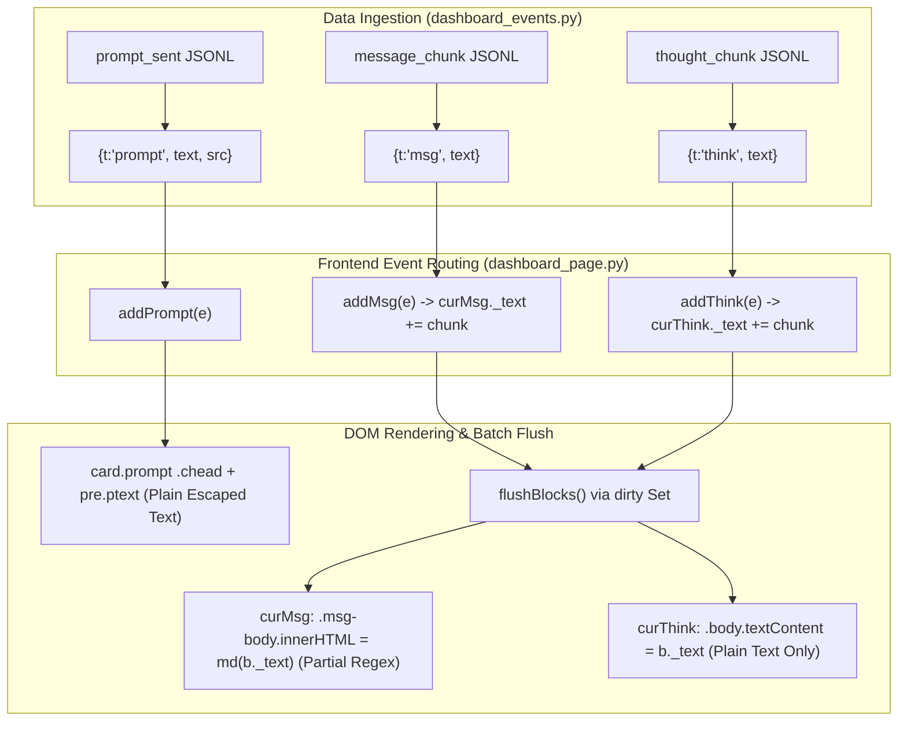

# Agent Bridge Dashboard Markdown Rendering Investigation Report

**Document Version:** 1.0.0  
**Date:** September 18, 2026  
**Role:** Read-only Explorer  
**Target Report File:** `C:\Users\Touma\Documents\Agent-Bridge\.agent-bridge-reports\09-18-2026-dashboard-markdown-explorer.md`  
**Active Worktree:** `C:\Users\Touma\Documents\Agent-Bridge` (branch: `main`)  
**Scope:** Investigation into Agent Bridge dashboard message rendering across all four timeline message kinds (*Dispatched message*, *User message*, *Agent message*, and *Thinking*) and design of an implementation-ready, safe Markdown rendering and sanitization strategy.  

---

## 1. Executive Summary & Core Findings

Agent Bridge's dashboard web interface displays conversation timelines composed of four primary text message kinds:
1. **Dispatched message**: Initial prompt or follow-up prompt sent by the orchestrator/coordinator (e.g. MCP client, Claude Code, Codex, Kimi).
2. **User message**: Interactive prompt authored directly by the user via the dashboard web UI composer (`#chatinput`).
3. **Agent message**: Text content generated by the autonomous agent worker (`message_chunk`).
4. **Thinking**: Model reasoning thoughts generated by reasoning-capable models (`thought_chunk`).

### Current Status Across All Four Kinds

| Timeline Message Kind | Wire Event / Source | Current Rendering Method | Rich Markdown Support | Key Deficiencies / Behavior |
| :--- | :--- | :--- | :--- | :--- |
| **Dispatched message** | `prompt` (`src !== "dashboard"`) | Inlined `<pre class="ptext">${esc(e.text)}</pre>` | **None (0%)** | Rendered entirely inside a `<pre>` monospace block. No headings, code blocks, lists, links, or text formatting. |
| **User message** | `prompt` (`src === "dashboard"`) | Inlined `<pre class="ptext">${esc(e.text)}</pre>` | **None (0%)** | Same `<pre>` container as Dispatched message. Only difference is card styling tint (`.card.prompt.user`). Zero formatting. |
| **Agent message** | `msg` (`message_chunk`) | `div.msg-body` via `innerHTML = md(b._text)` | **Partial (~30%)** | Handled by primitive regex `md()` in [`src/agent_bridge/share/dashboard_page.py#L1043-L1075`](file:///C:/Users/Touma/Documents/Agent-Bridge/src/agent_bridge/share/dashboard_page.py#L1043-L1075). Discards code fence languages, lacks links, lacks italics, breaks nested lists, lacks blockquotes, tables, and rules. |
| **Thinking** | `think` (`thought_chunk`) | `div.body` via `.textContent = b._text` | **None (0%)** | Rendered strictly as raw unformatted text via `.textContent`. Fenced code, inline code, and lists output as literal raw text. |

### Architectural Constraints

1. **Strict Zero-External-Network CSP**: The dashboard server sends:
   ```http
   Content-Security-Policy: default-src 'none'; script-src 'unsafe-inline'; style-src 'unsafe-inline'; img-src data:; connect-src 'self'; base-uri 'none'; form-action 'none'
   ```
   ([`src/agent_bridge/share/dashboard.py#L206-L210`](file:///C:/Users/Touma/Documents/Agent-Bridge/src/agent_bridge/share/dashboard.py#L206-L210)). **External JavaScript libraries (e.g. CDN `marked.js`, `DOMPurify`, `Prism.js`) are strictly blocked by the browser.**
2. **Single-Page Inline String Architecture**: The entire SPA frontend is stored as a raw Python string `PAGE` in [`src/agent_bridge/share/dashboard_page.py`](file:///C:/Users/Touma/Documents/Agent-Bridge/src/agent_bridge/share/dashboard_page.py). It must remain self-contained, with no node build-step or wheel asset bloat.
3. **Dual Execution Harnesses**: The JavaScript code is executed both in modern browsers and in Node.js test runners:
   - `tests/dashboard_status_behavior.js` runs `PAGE`'s inline `<script>` in a Node `vm` context with custom minimal DOM stubs.
   - `scripts/bench_dashboard_replay.js` benchmarks replay in `jsdom`.
   - Python unit tests in `tests/test_dashboard_page.py` enforce string contracts.
4. **Streaming Incremental Re-rendering**: `message_chunk` and `thought_chunk` tokens stream into `curMsg._text` and `curThink._text`. Flushes occur at interval ticks or turn ends. The Markdown engine must be fast, synchronous, and ReDoS-immune.

---

## 2. Deep Dive: Current Rendering Paths for Each Message Kind



### 2.1 Dispatched Message
- **Source**: Dispatched by orchestrator/coordinator tools (e.g. `dispatch_task`) via `prompt_sent` where `data.source != "dashboard"`.
- **Event object**: `{t: "prompt", ts: "...", text: "...", src: "coordinator", task: "..."}`.
- **Handling Function**: `addPrompt(e)` at [`src/agent_bridge/share/dashboard_page.py#L1535-L1546`](file:///C:/Users/Touma/Documents/Agent-Bridge/src/agent_bridge/share/dashboard_page.py#L1535-L1546):
  ```javascript
  function addPrompt(e){
    closeBlocks();
    lastPromptTs=e.ts;
    const user=e.src==="dashboard";
    const d=document.createElement("div");d.className="block card prompt"+(user?" user":"");
    const long=e.text.length>900;
    d.innerHTML=`<div class="chead">${icon(user?"msg":"doc",15)}<span>${esc(t(user?"transcript.user_message":"transcript.dispatched_message"))}</span><span class="ctime">${esc(fmtTs(e.ts))}</span></div>
      <pre class="ptext ${long?"clamp":""}">${esc(e.text)}</pre>`;
    if(long){const x=document.createElement("button");x.type="button";x.className="expand";x.textContent=t("transcript.show_more");
      x.onclick=()=>{d.querySelector("pre").classList.remove("clamp");x.remove()};d.appendChild(x)}
    content.appendChild(d);
  }
  ```
- **Current Render Output**:
  - Encapsulated in `<pre class="ptext">`.
  - Escaped via `esc(e.text)` so characters like `<`, `>`, `&` become `&lt;`, `&gt;`, `&amp;`.
  - Stored inside monospace preformatted text.
  - Zero Markdown formatting. Fenced code blocks, bullet points, and markdown links output as raw plain text with syntax markers intact.
  - Clamping logic: if `length > 900`, adds `clamp` class (`max-height: 120px; overflow: hidden`) and an "expand" button.

### 2.2 User Message
- **Source**: User prompt entered via dashboard composer `#chatinput` sending `/api/send`.
- **Event object**: `{t: "prompt", ts: "...", text: "...", src: "dashboard"}`.
- **Handling Function**: Shares `addPrompt(e)` with Dispatched message.
- **Current Render Output**: Identical to Dispatched message, with `.user` class added to `.card.prompt` for blue accent tinting (`background: var(--accent-tint); border-left: 3px solid var(--accent);`). Completely plain text inside `<pre>`.

### 2.3 Agent Message
- **Source**: Worker agent streaming output tokens (`message_chunk`).
- **Event object**: `{t: "msg", ts: "...", text: "..."}`.
- **Handling Functions**:
  - `msgBlock(ts)` at [`dashboard_page.py#L1547-L1553`](file:///C:/Users/Touma/Documents/Agent-Bridge/src/agent_bridge/share/dashboard_page.py#L1547-L1553) creates container:
    ```javascript
    curMsg.innerHTML=`<div class="chead">${icon("msg",15)}<span>${esc(t("transcript.agent"))}</span><span class="ctime">${esc(fmtTs(ts))}</span></div><div class="msg-body"></div>`;
    ```
  - `addMsg(e)` appends text: `curMsg._text += e.text; dirty.add(curMsg);`.
  - `flushBlocks()` at [`dashboard_page.py#L1520-L1528`](file:///C:/Users/Touma/Documents/Agent-Bridge/src/agent_bridge/share/dashboard_page.py#L1520-L1528) performs render:
    ```javascript
    b.querySelector(".msg-body").innerHTML = md(b._text);
    ```

### 2.4 Thinking
- **Source**: Worker agent model thoughts (`thought_chunk`).
- **Event object**: `{t: "think", ts: "...", text: "..."}`.
- **Handling Functions**:
  - `addThink(e)` at [`dashboard_page.py#L1557-L1563`](file:///C:/Users/Touma/Documents/Agent-Bridge/src/agent_bridge/share/dashboard_page.py#L1557-L1563):
    ```javascript
    curThink = document.createElement("details");
    curThink.className = "block think";
    curThink.innerHTML = `<summary>${icon("sparkle",14)}<span class="tlabel">${esc(t("transcript.thinking"))}</span><span class="chev">${icon("chevron",13)}</span></summary><div class="body"></div>`;
    ```
  - `curThink._text += e.text; dirty.add(curThink);`.
  - `flushBlocks()` updates:
    ```javascript
    if(b.tagName==="DETAILS"){
      b.querySelector(".body").textContent=b._text;
      b.querySelector(".tlabel").textContent=thinkLabel(b._text);
    }
    ```
- **Current Render Output**: Strictly assigned using `.textContent`. All model reasoning formatting (markdown lists, inline code, bold text, code examples) is displayed as raw literal text.
- **Styling**: `details.think .body` has `padding: 10px 14px 13px; color: var(--dim); font-size: 13px; white-space: pre-wrap; word-break: break-word;`.

---

## 3. Detailed Root Cause Analysis: Why Agent Message is Only Partially Rendered

The function `function md(src)` in [`src/agent_bridge/share/dashboard_page.py#L1043-L1075`](file:///C:/Users/Touma/Documents/Agent-Bridge/src/agent_bridge/share/dashboard_page.py#L1043-L1075) is a primitive ~30-line regex heuristic:

```javascript
function md(src){
  const parts=String(src).split(/(```[\s\S]*?(?:```|$))/);
  let out="";
  for(let i=0;i<parts.length;i++){
    let p=parts[i];
    if(i%2===1){ // fenced code
      const m=p.match(/^```(\w*)\n?([\s\S]*?)(?:```)?$/);
      out+="<pre><code>"+esc(m?m[2]:p)+"</code></pre>";
      continue;
    }
    p=esc(p);
    p=p.replace(/`([^`\n]+)`/g,"<code>$1</code>");
    const lines=p.split("\n"), buf=[];
    let list=null;
    const flushList=()=>{if(list){buf.push(`<${list}>`+listItems.join("")+`</${list}>`);list=null;listItems=[]}};
    let listItems=[];
    for(const ln of lines){
      const h=ln.match(/^(#{1,4})\s+(.*)/);
      const ul=ln.match(/^\s*[-*•]\s+(.*)/);
      const ol=ln.match(/^\s*\d+[.)]\s+(.*)/);
      if(h){flushList();buf.push(`<h${h[1].length}>${h[2]}</h${h[1].length}>`)}
      else if(ul){if(list!=="ul"){flushList();list="ul"}listItems.push("<li>"+ul[1]+"</li>")}
      else if(ol){if(list!=="ol"){flushList();list="ol"}listItems.push("<li>"+ol[1]+"</li>")}
      else{flushList();buf.push(ln)}
    }
    flushList();
    p=buf.join("\n");
    p=p.replace(/\*\*([^*]+)\*\*/g,"<b>$1</b>");
    p=p.replace(/(^|\n)\s*\n/g,"\n").split(/\n{2,}/).map(x=>x.trim()?(/^<h|^<pre|^<ul|^<ol/.test(x)?x:"<p>"+x.replace(/\n/g,"<br>")+"</p>"):"").join("");
    out+=p;
  }
  return out;
}
```

### Specific Deficiencies in `md(src)`:

1. **Zero Link Support**:
   - `[text](url)` and `<https://...>` are completely unparsed.
   - Links render as raw strings like `[agent-bridge](https://github.com/...)`. Users cannot click on documentation, repository URLs, or issue links.
2. **Language Tags Discarded**:
   - `^```(\w*)` regex captures the language into `m[1]`, but it is immediately **discarded**: `out += "<pre><code>" + esc(m ? m[2] : p) + "</code></pre>"`.
   - No `class="language-..."` or `data-lang="..."` is generated.
   - Furthermore, `\w*` rejects languages with hyphens, plus signs, or dots (e.g. `c++`, `shell-session`, `zh-CN`).
3. **No Italics, Strikethrough, or Nested Emphasis**:
   - Only `**bold**` is recognized via `\*\*([^*]+)\*\*`.
   - `*italic*`, `_italic_`, `__bold__`, `***bold italic***`, and `~~strikethrough~~` are ignored and left with raw punctuation.
4. **Brittle, Flat List Parsing**:
   - Only flat single lines matching `^\s*[-*•]\s+(.*)` are parsed.
   - Nested lists (indentation 2-4 spaces) are flattened or broken into multiple disconnected tags.
   - Task lists (`- [ ]`, `- [x]`) are not recognized.
   - Multiline list items break list continuity.
5. **No Blockquotes**:
   - Lines starting with `>` are completely ignored and rendered as standard text prefixed with `&gt;`.
6. **No Tables**:
   - Markdown pipe tables (`| col | col |`) are not recognized. They render as messy text lines.
7. **No Horizontal Rules**:
   - `---` or `***` treated as unstyled text lines or list delimiters.
8. **Fragile Paragraph / `<br>` Synthesis**:
   - Splitting on `\n{2,}` and replacing single `\n` with `<br>` inside `<p>` creates unnatural vertical whitespace around block elements.

---

## 4. Safe Rendering and Sanitization Strategy Compatible with this Codebase

### 4.1 Threat Model & Security Requirements

| Attack Vector / Risk | Threat Scenario | Required Mitigation |
| :--- | :--- | :--- |
| **Raw HTML Injection / Script Execution** | Model or malicious task prompt outputs `<script>alert(1)</script>` or ``. | **Strict Escape-First Pipeline**: All input text is escaped through `esc()` before markdown transformations. No raw HTML tag is ever executed. |
| **Malicious URL Schemes (XSS via `href`)** | Markdown link contains `[click here](javascript:stealTokens())` or `[payload](data:text/html;base64,...)`. | **Protocol Allowlist**: Links are strictly validated against `^(?:https?:\/\/|mailto:|\/|#)`. Any unrecognized scheme is neutralized or rendered as plain text. |
| **Reverse Tabnabbing / Opener Hijacking** | Target link navigates the parent window via `window.opener.location`. | **Anchor Hardening**: Every generated `<a>` element must carry `target="_blank" rel="noopener noreferrer"`. |
| **CSP Violation & Asset Leaks** | Markdown image `` tracking user IP/cookies. | **Image Policy**: CSP explicitly restricts `img-src data:;`. External image URLs are blocked by CSP; parser should render images as safe descriptive links or plain alt-text. |
| **ReDoS / Long-Task UI Freezing** | Pathological markdown text freezes regex evaluation in the browser UI thread. | **Linear Tokenizer / Non-Backtracking Patterns**: Avoid greedy overlapping regexes (`([\s\S]*?)`). Process blocks line-by-line and inlines with bounded lookaheads. |
| **Streaming Re-render Thrashing** | Markdown parser runs thousands of times during token streaming. | **Batch Flush Contract**: Preserve `dirty` set and `flushBlocks()` architecture. Handlers only append to `_text` and mark dirty; render executes once per rAF slice or poll tick. |

### 4.2 Why an Escape-First, Self-Contained Engine is Required

Instead of pulling in a heavy external bundle (which would break CSP, violate the single-source inline string architecture, and require Node build tools), Agent Bridge requires a **compact, zero-dependency, escape-first Markdown engine** embedded directly in `PAGE`:

1. **Step 1: Code Block Extraction & Protection**
   - Extract fenced code blocks (` ```lang ... ``` `) first using index/line scanning or non-backtracking split.
   - For each fenced block:
     - Sanitize `lang` against `^[a-zA-Z0-9_+-]+$`.
     - Escape the code body via `esc()`.
     - Emit `<pre><code class="language-${lang}">${escapedCode}</code></pre>`.
   - Replace with safe placeholders so subsequent inline processing ignores code contents.
2. **Step 2: Inline Code Protection**
   - Extract inline code (`` `code` ``).
   - Escape code body via `esc()`.
   - Emit `<code>${escapedCode}</code>`.
   - Protect with placeholders.
3. **Step 3: Escape Non-Code Text**
   - Run all remaining text through `esc()`:
     `&` $\to$ `&amp;`, `<` $\to$ `&lt;`, `>` $\to$ `&gt;`, `"` $\to$ `&quot;`, `'` $\to$ `&#39;`.
   - This provides **100% mathematical prevention of XSS**, because no browser HTML tag can survive `esc()`.
4. **Step 4: Block-Level Transformations**
   - Line-by-line block state machine handling:
     - Headings (`# ` to `#### `) $\to$ `<h1>` to `<h4>`.
     - Blockquotes (`&gt; `) $\to$ `<blockquote>`.
     - Horizontal rules (`---`, `***`) $\to$ `<hr>`.
     - Lists: Unordered (`-`, `*`), Ordered (`1.`, `2.`), Task lists (`[ ]`, `[x]`).
       Supports nested levels via indentation (2 or 4 spaces) and renders `<ul class="task-list">` with `<input type="checkbox" disabled>`.
     - Paragraphs: Wrap non-block lines into `<p>`.
5. **Step 5: Inline Formatting & Safe Links**
   - Bold/Italic:
     - `\*\*\*([^*]+)\*\*\*` $\to$ `<b><i>$1</i></b>`.
     - `\*\*([^*]+)\*\*` or `__([^_]+)__` $\to$ `<b>$1</b>`.
     - `\*([^*]+)\*` or `_([^_]+)_` $\to$ `<i>$1</i>`.
     - `~~([^~]+)~~` $\to$ `<del>$1</del>`.
   - Safe Links:
     - Match `\[([^\]]+)\]\(([^)\s]+)\)`.
     - Verify URL matches `/^(?:https?:\/\/|mailto:|\/|#)/i`.
     - Emit `<a href="${safeUrl}" target="_blank" rel="noopener noreferrer">${safeLabel}</a>`.
     - If URL fails validation (e.g. `javascript:...`), emit `${safeLabel} (<code>${safeUrl}</code>)` without an active hyperlink.
6. **Step 6: Reinsert Protected Code Blocks**
   - Replace placeholders with the pre-escaped code blocks and inline codes.

---

## 5. Architectural Blueprint for All Four Timeline Message Kinds

### 5.1 Dispatched Message & User Message Unified Markdown Container

Currently, `addPrompt(e)` generates:
```html
<pre class="ptext ${long?"clamp":""}">${esc(e.text)}</pre>
```

#### Blueprint:
Replace the `<pre class="ptext">` with a rich markdown container while preserving `.ptext` and `.clamp` classes so CSS clamping and the "Show more" button continue to work transparently:
```javascript
function addPrompt(e){
  closeBlocks();
  lastPromptTs=e.ts;
  const user=e.src==="dashboard";
  const d=document.createElement("div");d.className="block card prompt"+(user?" user":"");
  const long=e.text.length>900;
  d.innerHTML=`<div class="chead">${icon(user?"msg":"doc",15)}<span>${esc(t(user?"transcript.user_message":"transcript.dispatched_message"))}</span><span class="ctime">${esc(fmtTs(e.ts))}</span></div>
    <div class="prompt-body ptext ${long?"clamp":""}">${md(e.text)}</div>`;
  if(long){const x=document.createElement("button");x.type="button";x.className="expand";x.textContent=t("transcript.show_more");
    x.onclick=()=>{d.querySelector(".ptext").classList.remove("clamp");x.remove()};d.appendChild(x)}
  content.appendChild(d);
}
```

### 5.2 Thinking Block Markdown Rendering

Currently, `flushBlocks()` updates Thinking blocks with:
```javascript
b.querySelector(".body").textContent=b._text;
```

#### Blueprint:
Update `flushBlocks()` to render markdown into `.body`:
```javascript
function flushBlocks(){
  for(const b of dirty){
    if(b.tagName==="DETAILS"){
      b.querySelector(".body").innerHTML=md(b._text);
      b.querySelector(".tlabel").textContent=thinkLabel(b._text);
    }else b.querySelector(".msg-body").innerHTML=md(b._text);
  }
  dirty.clear();
}
```

#### CSS Adjustment for Thinking Body:
`details.think .body` currently has `white-space: pre-wrap;`. When block-level HTML tags (`<p>`, `<ul>`, `<pre>`) are inserted, `white-space: pre-wrap` causes double-spaced line gaps.
Adjust CSS:
```css
details.think .body{padding:10px 14px 13px;color:var(--dim);font-size:13px;word-break:break-word}
details.think .body p{margin:4px 0}
details.think .body pre{background:var(--panel2);border:1px solid var(--border);border-radius:6px;padding:8px;margin:6px 0;font-size:12px}
details.think .body code{background:var(--panel3);padding:1px 4px;border-radius:3px;font-size:12px}
details.think .body pre code{background:none;padding:0}
```

### 5.3 Unified Markdown Typography Styles
Consolidate `.msg-body`, `.prompt-body`, and `details.think .body` styles:
```css
.msg-body, .prompt-body{font-size:14px;line-height:1.55;word-break:break-word}
.msg-body p, .prompt-body p{margin:6px 0}
.msg-body pre, .prompt-body pre{background:var(--panel2);border:1px solid var(--border);border-radius:8px;
  padding:10px 12px;overflow-x:auto;font:12.5px/1.5 var(--font-mono);margin:8px 0}
.msg-body code, .prompt-body code{font-family:var(--font-mono);background:var(--panel3);border-radius:4px;
  padding:1px 5px;font-size:12.5px}
.msg-body pre code, .prompt-body pre code{background:none;padding:0}
.msg-body h1, .msg-body h2, .msg-body h3, .msg-body h4,
.prompt-body h1, .prompt-body h2, .prompt-body h3, .prompt-body h4{margin:12px 0 6px;font-size:15px;font-weight:700}
.msg-body ul, .msg-body ol, .prompt-body ul, .prompt-body ol{margin:6px 0;padding-left:22px}
.msg-body li, .prompt-body li{margin:2px 0}
.msg-body blockquote, .prompt-body blockquote{border-left:3px solid var(--border);margin:8px 0;padding:2px 0 2px 12px;color:var(--dim)}
.msg-body a, .prompt-body a{color:var(--accent);text-decoration:underline;text-underline-offset:2px}
.msg-body a:hover, .prompt-body a:hover{color:var(--accent-hover)}
.msg-body hr, .prompt-body hr{border:none;border-top:1px solid var(--border);margin:12px 0}
```

---

## 6. Exact Files and Symbols to Change

```
src/agent_bridge/
└── share/
    └── dashboard_page.py        <-- Primary implementation target

tests/
├── test_dashboard_page.py       <-- Python contract and snapshot tests
└── dashboard_status_behavior.js <-- Fast Node vm behavioral unit tests
```

### 6.1 `src/agent_bridge/share/dashboard_page.py`

| Symbol / Location | Current Line | Change Description |
| :--- | :--- | :--- |
| **CSS section** | ~L246-L268 | Update `.card pre.ptext`, `.msg-body`, and `details.think .body`. Add unified styles for `.prompt-body`, links (`a`), blockquotes (`blockquote`), horizontal rules (`hr`), task lists, and syntax blocks. |
| `function md(src)` | L1043-L1075 | Replace existing minimal regex function with the comprehensive, safe escape-first Markdown parser. |
| `function flushBlocks()` | L1520-L1528 | Change `b.querySelector(".body").textContent = b._text;` to `b.querySelector(".body").innerHTML = md(b._text);`. Keep `thinkLabel(b._text)`. |
| `function addPrompt(e)` | L1535-L1546 | Replace `<pre class="ptext ...">${esc(e.text)}</pre>` with `<div class="prompt-body ptext ${long?"clamp":""}">${md(e.text)}</div>`. Keep `.ptext` selector compatibility for clamp/expand. |

### 6.2 `tests/dashboard_status_behavior.js`
Add direct behavioral test suites in the Node execution harness:
- Test `md()` escapes `<script>` and raw tags.
- Test `md()` preserves code blocks with language tags (`<code class="language-python">`).
- Test `md()` parses safe links and blocks `javascript:` URLs.
- Test `md()` parses bold, italics, ordered and unordered lists, task lists, and blockquotes.
- Test `addPrompt()` produces clamped markdown container for long text and unclamped for short text.
- Test `flushBlocks()` renders markdown in both `.msg-body` and `.body` (thinking).

### 6.3 `tests/test_dashboard_page.py`
Add Python contract tests to lock in rendering requirements:
- `test_markdown_rendering_all_four_kinds`: asserts `PAGE` routes Dispatched message, User message, Agent message, and Thinking through markdown rendering.
- `test_markdown_xss_prevention`: validates that raw HTML tags are escaped and safe protocol allowlists are in place.
- `test_markdown_folds_and_clamping_preserved`: verifies that `clamp`, `expand`, `curThink`, and `tooldetail` contracts remain unbroken.

---

## 7. Interaction with Current Dirty Candidate & Active Worktree

The active worktree on branch `main` is currently dirty across several files:
- `src/agent_bridge/adapters/antigravity.py` (antigravity thinking stream parsing)
- `src/agent_bridge/dashboard.py` (WMI brokered detached launch)
- `src/agent_bridge/share/dashboard.py` (`PRESENCE_TTL = 180.0`)
- `src/agent_bridge/share/dashboard_page.py` (L465: `setInterval(()=>ping(0),15000);`)
- `tests/test_dashboard_open.py`, `tests/test_dashboard_page.py` (presence and open tests)
- `tests/fake_agy.py`, `tests/test_agy_dashboard.py`, `tests/test_agy_parse.py` (adapter tests)

### Intersection Analysis:
1. **`dashboard_page.py` Intersection**:
   - The current dirty change in `dashboard_page.py` is strictly at **line 465** (`setInterval(()=>ping(0),15000);`).
   - Markdown changes occur at **lines 246-268** (CSS), **lines 1043-1075** (`md`), **lines 1520-1528** (`flushBlocks`), and **lines 1535-1546** (`addPrompt`).
   - **Result**: Zero merge conflict or line overlap. The changes are completely orthogonal.
2. **`test_dashboard_page.py` Intersection**:
   - The current dirty changes in `test_dashboard_page.py` are at **lines 2020-2070** (`test_presence_survives_throttled_heartbeat`).
   - New markdown tests will be added in a new test function section (around line 900 or 1330).
   - **Result**: Zero merge conflict or line overlap.
3. **`sessionToMarkdown` Export Contract**:
   - `sessionToMarkdown(s, evs)` at [`dashboard_page.py#L1720-L1790`](file:///C:/Users/Touma/Documents/Agent-Bridge/src/agent_bridge/share/dashboard_page.py#L1720-L1790) formats transcript downloads.
   - It relies on `mdLine`, `mdCode`, and `mdFence` (lines 1712-1718).
   - **Result**: Must remain untouched. Markdown DOM rendering does not alter the download format.

---

## 8. Explicit Do-Not-Touch Areas

To prevent destabilizing existing ongoing work, any future implementation MUST treat the following areas as strictly off-limits:

1. **Dashboard Process Brokering & Lifecycle**:
   - DO NOT edit [`src/agent_bridge/dashboard.py`](file:///C:/Users/Touma/Documents/Agent-Bridge/src/agent_bridge/dashboard.py) (`_popen_brokered`, `_powershell_path`, `_popen_detached`, `_wait_for_dashboard`).
   - DO NOT edit [`src/agent_bridge/share/dashboard.py`](file:///C:/Users/Touma/Documents/Agent-Bridge/src/agent_bridge/share/dashboard.py) presence tracking (`presence_update`, `presence_count`, `PRESENCE_TTL`).
2. **Heartbeat & Browser Visibility Hooks**:
   - DO NOT edit [`src/agent_bridge/share/dashboard_page.py#L460-L473`](file:///C:/Users/Touma/Documents/Agent-Bridge/src/agent_bridge/share/dashboard_page.py#L460-L473) (`ping`, `setInterval`, `pagehide`, `focus`, `online`, `visibilitychange`).
3. **Adapter Implementation & Thinking Ingestion**:
   - DO NOT edit [`src/agent_bridge/adapters/antigravity.py`](file:///C:/Users/Touma/Documents/Agent-Bridge/src/agent_bridge/adapters/antigravity.py) or `dashboard_events.py`.
4. **Outbox, Dequeue, and Composer Send Logic**:
   - DO NOT edit `sendPrompt`, `chatinput` keyboard handlers, `/api/send`, or `/api/task_action`.
5. **Timeline Rail Navigation & Ruler Wave**:
   - DO NOT edit `MARK_SEL`, `layoutRail`, `updateCurMark`, `updateRulerWave`, `jumpToMark`.
6. **Transcript Markdown Export**:
   - DO NOT modify `sessionToMarkdown`, `buildTranscriptFilename`, `sanitizeFilename`, `mdLine`, `mdCode`, `mdFence` ([`dashboard_page.py#L1692-L1790`](file:///C:/Users/Touma/Documents/Agent-Bridge/src/agent_bridge/share/dashboard_page.py#L1692-L1790)).
7. **i18n Dictionaries**:
   - DO NOT alter existing translation strings in `LOCALES` ([`dashboard_page.py#L484-L1031`](file:///C:/Users/Touma/Documents/Agent-Bridge/src/agent_bridge/share/dashboard_page.py#L484-L1031)).

---

## 9. One Bounded Implementation Slice

The entire Markdown rendering enhancement fits into a single, tightly bounded implementation slice:

### Slice: Safe Client-Side Markdown Rendering for Dashboard Timeline
1. **Frontend Parser & Rendering (`src/agent_bridge/share/dashboard_page.py`)**:
   - Upgrade `function md(src)` with the escape-first, safe tokenizer supporting code blocks (with language class), safe links (`http:`, `https:`, `mailto:`), nested/task lists, inline code, bold/italics, and blockquotes.
   - Update `addPrompt(e)` to render markdown in `<div class="prompt-body ptext ${long?"clamp":""}">`.
   - Update `flushBlocks()` to render markdown in Thinking (`b.querySelector(".body").innerHTML = md(b._text)`).
   - Update CSS in `PAGE` to style markdown elements inside `.prompt-body`, `.msg-body`, and `details.think .body`.
2. **Behavioral Test Suite (`tests/dashboard_status_behavior.js`)**:
   - Add unit tests for `md()` parsing, XSS tag escaping, protocol allowlists, and all four message kinds.
3. **Python Contract Test Suite (`tests/test_dashboard_page.py`)**:
   - Add contract assertions for the expanded markdown pipeline and safety invariants.

---

## 10. Acceptance Criteria

1. **Four Message Kinds Render Rich Markdown**:
   - [ ] Dispatched message renders code blocks, bold/italics, lists, and links properly.
   - [ ] User message renders code blocks, bold/italics, lists, and links properly.
   - [ ] Agent message renders code blocks (with language class), bold/italics, lists, links, and blockquotes properly.
   - [ ] Thinking block renders rich markdown inside `.body` without whitespace distortion.
2. **Interactive Controls & Layout Preserved**:
   - [ ] Long prompts (>900 chars) in Dispatched and User messages are clamped at 120px with gradient fade.
   - [ ] Clicking "Show more" (`.expand`) expands the card to full height.
   - [ ] Thinking `<details>` fold remains closed by default, displays word/character count in summary label, and expands smoothly on click.
3. **Security & Sanitization**:
   - [ ] `<script>`, `<iframe>`, ``, and arbitrary HTML tags are strictly escaped as text entities and never execute.
   - [ ] Links with `javascript:` or `data:` schemes are neutralized and never rendered as executable links.
   - [ ] All rendered `<a>` tags carry `target="_blank" rel="noopener noreferrer"`.
4. **Performance & Streaming Replay**:
   - [ ] `node scripts/bench_dashboard_replay.js` passes without regression in `msgBodySets` or frame budgets.
   - [ ] Batch flushing via `dirty` set remains intact; `addMsg` does not execute DOM writes per chunk.
5. **Transcript Export Integrity**:
   - [ ] `sessionToMarkdown` continues to produce valid downloadable markdown files without changes.
6. **Test Suites Green**:
   - [ ] `node tests/dashboard_status_behavior.js` exits code 0 with all assertions passing.
   - [ ] `uv run pytest tests/test_dashboard_page.py` passes 100%.

---

## 11. Exact Fast Test Commands

The following commands should be used to verify the implementation quickly and deterministically:

### 1. Ultra-Fast Node Behavioral Unit Tests (~2 seconds)
Tests the inline JavaScript from `PAGE` directly in Node's VM context without starting a server:
```powershell
node tests/dashboard_status_behavior.js
```

### 2. Fast Focused Pytest Contract Tests (~3 seconds)
Runs targeted contract tests against `dashboard_page.py`:
```powershell
uv run pytest tests/test_dashboard_page.py -k "test_folds_stay_closed_initially or test_perf_architecture_hooks or test_transcript_download_contract"
```

### 3. Replay Benchmark Test (~5 seconds)
Verifies replay performance, batch flushing, and frame budget under jsdom:
```powershell
node scripts/bench_dashboard_replay.js
```

### 4. Full Dashboard Page Test Suite (~50 seconds)
Runs the full end-to-end integration and HTTP server tests:
```powershell
uv run pytest tests/test_dashboard_page.py
```
